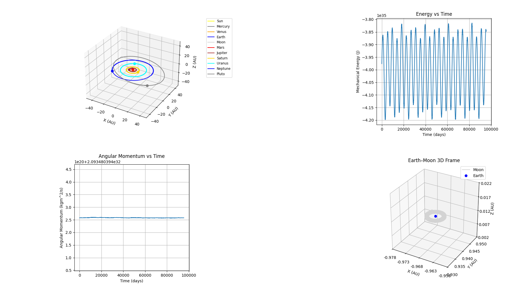

# N-Body Solar System Simulation

A Newtonian N-body simulation of the Solar System written in Python. This project models the gravitational interactions between the Sun, planets, the Moon, and Pluto in full 3D heliocentric coordinates.

Initial conditions are sourced from **NASA JPL Horizons**.

## Key Features

* Full **N-body Newtonian gravity** 
* **True heliocentric state vectors** from NASA JPL Horizons
* Real-time **3D orbital visualization** using matplotlib
* Continuous **mechanical energy conservation** tracking
* Continuous **angular momentum conservation** tracking
* Dedicated **Earth–Moon reference graph** that is a zoomed in version tracking the Earth at the center of this graph
* Modular object-based design for easy extension
* Built for numerical experimentation and physics validation if desired

## Physics Model

Each body evolves according to Newton’s law of gravitation:

$$
\mathbf{F}_{ij} = G \frac{m_i m_j}{|\mathbf{r}_j - \mathbf{r}_i|^3} (\mathbf{r}_j - \mathbf{r}_i)
$$

Accelerations are computed by summing the gravitational contributions from all other bodies. Positions and velocities are updated using a fixed timestep integrator designed to preserve long-term orbital stability.

The simulation explicitly tracks:

* Total mechanical energy
* Total angular momentum

These diagnostics are used to verify physical correctness and integration quality.

## Coordinate System

* **Frame:** Heliocentric
* **Axes:** Right-handed Cartesian (X, Y, Z)
* **Units:**

  * Position: Astronomical Units (AU)
  * Velocity: meters per second (m/s)
  * Mass: kilograms (kg)

A secondary visualization shows the **Earth–Moon system in a co-moving frame** to show the accuracy

## Initial Conditions

Initial positions and velocities are obtained from **NASA JPL Horizons**. This provides:

* Correct orbital phase
* Real eccentricity and inclination
* Consistent angular momentum and energy

Backup conditions are used just in case something can't be found from JPL Horizons

## Visualization Layout

The simulation window contains four panels:

1. **3D Solar System View** – Full heliocentric orbits
2. **Energy vs. Time** – Mechanical energy conservation
3. **Angular Momentum vs. Time** – Numerical stability check
4. **Earth–Moon Frame** – Local dynamics in 3D

Legends are rendered outside the axes to preserve plotting area while maintaining clarity.

## Example
This was taken from a set of about 30000 frames or about 90,000 days on a 3 day time interval. Note how angular momentum is conserved completely and energu olscilates, though there is no loss because the mean value stays constant so the time-averaged energy is constant 

## Numerical Notes

* The timestep is chosen to balance performance and stability.
* Energy and angular momentum drift indicate integrator limits.
* Long-term simulations may require smaller timesteps or higher-order symplectic methods.
* Do not use timesteps > 3 days as it may cause objects to fly away from wahtever is being orbited

